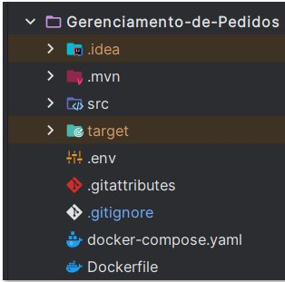

# API Sistema Escolar Simples
## Tecnologias Utilizadas
* **Java 21**
* **Spring Boot**
* **Docker** 
* **MySQL**
* **Maven**

## Funcionalidades
* **Turmas**
  * Criar, listar, atualizar, deletar turmas
* **Alunos**
  * Criar, listar, atualizar, deletar alunos
    
## Configuração do Ambiente

### Pré-requisitos

* Antes de começar, certifique-se de ter o [Docker Desktop](https://www.docker.com/products/docker-desktop/) e **em execução** em sua máquina.
* [Postman](https://www.postman.com/downloads/) instalado para a realização de testes na aplicação
## Passos para Iniciar o Projeto

1.  **Obtenha os Arquivos do Projeto:**
  * clone-o para sua máquina:
      ```bash
      git clone https://github.com/Glaudencio12/API-sistema-escolar-simples
      ```
2. **Configure as Variáveis de Ambiente**
* Crie um arquivo `.env` com as credenciais desejadas para que o mysql possa funcionar dentro do container.
* Esse arquivo `.env` deve ser criado na raiz no projeto:



* Exemplo de .env:
  ```env
    # Variáveis para o container MySQL (imagem mysql:8.0)
  
    MYSQL_USER=usuario_exemplo             # Usuário criado automaticamente no MySQL
    MYSQL_PASSWORD=senhaForte123           # Senha do usuário MYSQL_USER
    MYSQL_ROOT_PASSWORD=adminRoot2025      # Senha do usuário root (administrador) do MySQL
    
    # Variáveis para a aplicação Spring Boot (imagem da app)
  
    SPRING_DATASOURCE_URL=jdbc:mysql://db:3306/sistema_escolar?useTimezone=true&serverTimezone=UTC        # URL JDBC para conectar à base MySQL no container 'db'
    SPRING_DATASOURCE_USERNAME=usuario_exemplo       # Usuário que a aplicação usará para conectar no banco (deve ser igual a MYSQL_USER)
    SPRING_DATASOURCE_PASSWORD=senhaForte123         # Senha para o usuário acima (deve ser igual a MYSQL_PASSWORD)

  ```
3. **Inicie os Serviços com Docker Compose**
* Navegue até a pasta raiz do projeto no seu terminal e execute o comando abaixo.
    * **Importante:** Certifique-se de que os arquivos `docker-compose.yml` e o `Dockerfile` da aplicação estejam no diretório atual quando você abrir o terminal
   ```bash
   docker-compose up -d
   ```
   Esse comando irá:
   * Baixar a imagem da aplicação do Docker Hub (caso ainda não esteja localmente)
   * Subir o banco MySQL e a aplicação conectados em rede

4.  **Verifique a Execução dos Contêineres:**
  * Você pode confirmar que os contêineres estáo rodadno da seguinte maneira:
    * **Via Terminal:** Execute `docker ps` para ver uma lista dos contêineres ativos.

5.  **Acesse a Aplicação:**
  * Com os serviços em funcionamento, você pode testar a aplicação usando o Postaman ou Swagger (Falta realizar a implementação)

### Gerenciamento dos Contêineres

* **Para parar os serviços da aplicação execute:**
    ```bash
    docker compose stop
    ```
## Endpoints
### Turmas (`/class`)

* `GET /class` — Listar todas as turmas
* `GET /class/{id}` — Obter turma por ID
* `POST /class` — Criar nova turma
* `PUT /class/{id}` — Atualizar dados da turma via id e body
* `DELETE /class/{id}` — Deletar turma via id

### Alunos (`/student`)

* `GET /student` — Listar todos os alunos
* `GET /student/{id}` — Obter aluno por ID
* `POST /student/class/{idClass}` — Criar novo aluno 
* `PUT /student/{id}` — Atualizar dados do aluno via id e body
* `DELETE /student/{id}` — Deletar aluno via id

## Exemplos de Requests para a API

### 1. Criar Turma

`POST /class`

```json
{
  "name": "5º Ano A",
  "shift": "MANHA"
}
```

> **Observações:**
>
> * `name`: obrigatório, mínimo 2 caracteres
> * `shift`: obrigatório, deve ser um dos valores do enum `ShiftClass` — `"MANHA"`, `"TARDE"`, ou `"NOITE"`


### 2. Atualizar Turma

`PUT /class/{id}`

```json
{
  "name": "6º Ano B",
  "shift": "AFTERNOON"
}
```

### 3. Criar Aluno

`POST /student`

```json
{
  "name": "Maria Silva",
  "email": "maria.silva@email.com",
  "classId": 1
}
```

> * `name`: obrigatório, mínimo 3 caracteres
> * `email`: obrigatório, deve ser um e-mail válido


### 4. Atualizar Aluno

`PUT /student/{id}`

```json
{
  "name": "Maria Oliveira",
  "email": "maria.oliveira@email.com",
  "classId": 1
}
```
## Melhorias Futuras

* Adicionar documentação com Swagger/OpenAPI
* Criar testes automatizados
